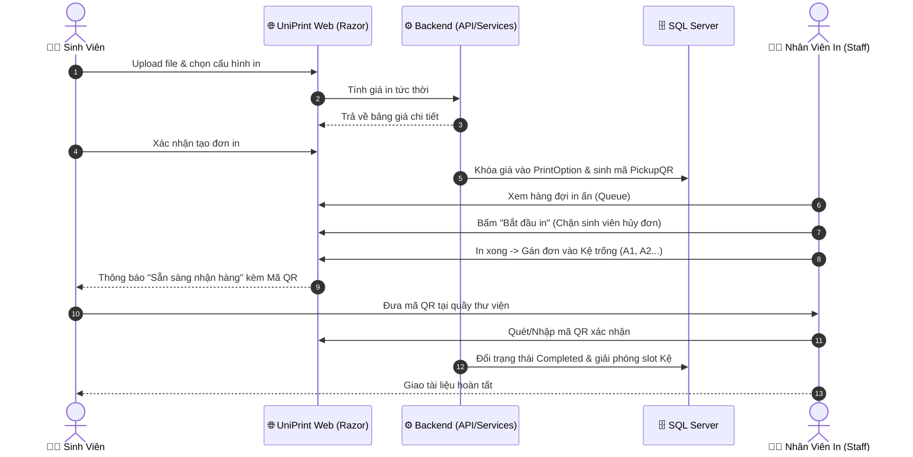

# 🖨️ UniPrint – Online Printing & Study Material Platform

> **Nền tảng In Ấn Trực Tuyến & Thư Viện Chia Sẻ Tài Liệu Học Tập Cho Sinh Viên**  
> Dự án môn học được xây dựng theo kiến trúc **N-Tier (N-Layer)** trên nền tảng **.NET 8 (LTS)** kết hợp **ASP.NET Core Web API** và **Razor Pages UI**.

[](https://dotnet.microsoft.com/)
[](https://learn.microsoft.com/ef/core/)
[]()
[]()

---

## 📌 MỤC LỤC
1. [Giới Thiệu Tổng Quan](#1-giới-thiệu-tổng-quan)
2. [Luồng Nghiệp Vụ Cốt Lõi (Business Flow)](#2-luồng-nghiệp-vụ-cốt-lõi-business-flow)
3. [Kiến Trúc Hệ Thống (N-Tier Architecture)](#3-kiến-trúc-hệ-thống-n-tier-architecture)
4. [Tài Khoản Đăng Nhập Mẫu (Seed Data)](#4-tài-khoản-đăng-nhập-mẫu-seed-data)
5. [Hướng Dẫn Khởi Chạy Dự Án (Quick Start)](#5-hướng-dẫn-khởi-chạy-dự-án-quick-start)
6. [Bản Đồ Route & Chức Năng (Pages & APIs)](#6-bản-đồ-route--chức-năng-pages--apis)
7. [Các Quy Tắc Nghiệp Vụ Quan Trọng (Business Rules & Edge Cases)](#7-các-quy-tắc-nghiệp-vụ-quan-trọng-business-rules--edge-cases)
8. [Phân Chia Trách Nhiệm Tính Năng (Feature Ownership)](#8-phân-chia-trách-nhiệm-tính-năng-feature-ownership)

---

## 1. Giới Thiệu Tổng Quan

**UniPrint** giải quyết bài toán chen lấn, chờ đợi in ấn tài liệu tại các trường đại học bằng cách số hóa toàn bộ quy trình:
* **Sinh viên (Student):** Upload tài liệu (PDF, Word), chọn cấu hình in (trắng đen/màu, 1 mặt/2 mặt, gáy/ghim), xem báo giá tự động, đặt đơn và đến nhận tài liệu thông qua việc quét **mã QR**.
* **Nhân viên in ấn (Staff):** Theo dõi hàng đợi in ấn tập trung, in tài liệu, phân loại tài liệu vào các **kệ lưu trữ (A1, A2, B1...)**, quét mã QR của sinh viên để xác nhận giao đồ.
* **Thư viện tài liệu (Study Hub):** Kho dữ liệu mở giúp sinh viên tải về hoặc in trực tiếp các slide bài giảng, tóm tắt môn học do cộng đồng chia sẻ (sau khi được Admin duyệt).
* **Quản trị viên (Admin):** Quản lý tài khoản, cấu hình bảng giá in ấn, kiểm duyệt nội dung Study Hub.

---

## 2. Luồng Nghiệp Vụ Cốt Lõi (Business Flow)

### 🔹 Luồng In Ấn & Giao Nhận Bằng Mã QR (Main Flow):


---

## 3. Kiến Trúc Hệ Thống (N-Tier Architecture)

Dự án được phân tách thành **4 Project rõ ràng** tuân thủ nguyên tắc N-Tier truyền thống:

```text
UniPrint/
├── UniPrint.DataAccess/         # [TẦNG DATA ACCESS - DAL]
│   ├── Entities/                # 15 Entities tách riêng từng file (User, Document, PrintOrder, Shelf...)
│   ├── Enums/                   # 5 Enums tách riêng từng file (UserRole, PrintOrderStatus...)
│   ├── Context/                 # UniPrintDbContext (EF Core, cấu hình quan hệ bảng & Seed Data)
│   └── Repositories/            # GenericRepository<T> & UnitOfWork (quản lý transaction)
│
├── UniPrint.Business/           # [TẦNG BUSINESS LOGIC - BLL]
│   ├── Common/                  # ApiResponse<T> chuẩn hóa dữ liệu trả về cho API
│   ├── DTOs/                    # Data Transfer Objects (Auth, PrintOrder, Document, StudyHub)
│   └── Services/                # Toàn bộ logic nghiệp vụ bám sát đặc tả:
│       ├── AuthService.cs       # Đăng ký, đăng nhập JWT, băm mật khẩu BCrypt
│       ├── DocumentService.cs   # Upload, đọc số trang, dung lượng file
│       ├── PriceCalculator.cs   # Thuật toán tính giá in & chiết khấu 2 mặt
│       ├── PrintOrderService.cs # Xử lý đơn in, xếp kệ, quét QR hoàn tất đơn
│       └── StudyHubService.cs   # Thư viện tài liệu, duyệt bài Admin, đánh giá sao
│
├── UniPrint.API/                # [TẦNG WEB API - RESTful Service]
│   ├── Controllers/             # RESTful API (AuthController, PrintOrdersController...)
│   ├── Middlewares/             # ExceptionHandlingMiddleware (bắt lỗi hệ thống tập trung)
│   └── Program.cs               # Cấu hình JWT Bearer, Swagger UI Authorize, CORS
│
└── UniPrint.Web/                # [TẦNG GIAO DIỆN - RAZOR PAGES UI]
    ├── Pages/                   # UI viết hoàn toàn bằng C# Razor Pages (.cshtml + .cshtml.cs):
    │   ├── Shared/_Layout.cshtml# Navbar điều hướng tích hợp phân quyền
    │   ├── Auth/                # Đăng nhập, đăng ký, trang cá nhân
    │   ├── Student/             # Đặt in trực tuyến, tính giá trực tiếp, lịch sử đơn
    │   ├── Staff/               # Hàng đợi in ấn Staff, quản lý gán kệ lưu trữ
    │   ├── Pickup/              # Quét mã QR xác nhận giao hàng
    │   └── StudyHub/            # ⭐ Kho tài liệu chia sẻ sinh viên (Module độc lập)
    └── Program.cs               # Cấu hình Cookie Authentication & DI Services
```

---

## 4. Tài Khoản Đăng Nhập Mẫu (Seed Data)

Database đã nạp sẵn 3 tài khoản mặc định đại diện cho 3 vai trò với mật khẩu chung là **`123456`**:

| Vai trò | Email đăng nhập | Mật khẩu | Quyền hạn trong hệ thống |
| :--- | :--- | :---: | :--- |
| **Admin** | `admin@uniprint.edu.vn` | `123456` | Toàn quyền: Duyệt tài liệu Study Hub, sửa bảng giá in ấn, quản lý User |
| **Staff** | `staff@uniprint.edu.vn` | `123456` | Tiếp nhận đơn hàng, in tài liệu, gán kệ (`A1`, `A2`, `B1`), quét QR giao hàng |
| **Student** | `student@uniprint.edu.vn` | `123456` | Upload file, chọn cấu hình in, xem giá, lấy mã QR nhận hàng, dùng Study Hub |

---

## 5. Hướng Dẫn Khởi Chạy Dự Án (Quick Start)

### Yêu cầu môi trường:
* [.NET 8 SDK (LTS)](https://dotnet.microsoft.com/download/dotnet/8.0)
* [Microsoft SQL Server](https://www.microsoft.com/sql-server) (bản 2016 trở lên hoặc SQL Server Express / LocalDB)
* Visual Studio 2022 (v17.8+) hoặc Visual Studio Code / JetBrains Rider

### Bước 1: Clone dự án về máy
```bash
git clone https://github.com/MinhTCCE190895/UniPrint-Backend.git
cd UniPrint-Backend
```

### Bước 2: Cập nhật chuỗi kết nối SQL Server
Mở file `UniPrint.Web/appsettings.json` và `UniPrint.API/appsettings.json`, kiểm tra chuỗi kết nối phù hợp với máy của bạn:
```json
"ConnectionStrings": {
  "DefaultConnection": "Server=localhost;Database=UniPrintDb;Trusted_Connection=True;MultipleActiveResultSets=true;TrustServerCertificate=True"
}
```

### Bước 3: Tạo Database & Nạp dữ liệu mẫu
Chạy lệnh Migration để tự động sinh các bảng và tài khoản mẫu:
```bash
dotnet ef migrations add InitialCreate --project UniPrint.DataAccess --startup-project UniPrint.Web
dotnet ef database update --project UniPrint.DataAccess --startup-project UniPrint.Web
```

### Bước 4: Chạy ứng dụng

#### 🔹 Cách 1: Chạy giao diện Web (Razor Pages):
```bash
dotnet run --project UniPrint.Web
```
👉 Mở trình duyệt truy cập: `https://localhost:5001` (hoặc cổng hiển thị trên Terminal).

#### 🔹 Cách 2: Chạy Backend RESTful API (Swagger UI):
```bash
dotnet run --project UniPrint.API
```
👉 Mở trình duyệt truy cập: `https://localhost:7000/swagger` để kiểm thử toàn bộ API.

---

## 6. Bản Đồ Route & Chức Năng (Pages & APIs)

### Giao diện Razor Pages (`UniPrint.Web`):
* `/` hoặc `/Index`: Trang chủ giới thiệu nền tảng.
* `/Auth/Login`: Trang đăng nhập bằng Email & Mật khẩu.
* `/Student/CreateOrder`: Form cấu hình in ấn & xem báo giá trực tiếp.
* `/Staff/Queue`: Hàng đợi in ấn cho nhân viên tiệm in.
* `/Pickup/ScanQR`: Giao diện quét / nhập mã QR giao tài liệu cho sinh viên.
* `/StudyHub/Index`: Thư viện tài liệu học tập cộng đồng.

### Endpoints REST API (`UniPrint.API`):
* `POST /api/auth/login`: Xác thực và cấp mã JWT Access Token.
* `POST /api/printorders/calculate-price`: Tính giá in dự kiến dựa trên số trang, màu sắc, loại in.
* `POST /api/printorders`: Sinh viên tạo đơn in mới kèm thông số chốt giá.
* `GET  /api/printorders/queue`: Staff lấy danh sách đơn chờ in.
* `POST /api/printorders/{id}/assign-shelf`: Gán đơn đã in xong vào kệ lưu trữ còn trống.
* `POST /api/printorders/scan-pickup-qr?qrToken=...`: Quét mã QR hoàn tất đơn in.
* `GET  /api/studyhub/materials`: Tìm kiếm và lọc tài liệu đã duyệt theo môn học, danh mục.
* `PATCH /api/studyhub/admin/materials/{id}/moderate`: Admin duyệt hoặc từ chối tài liệu.

---

## 7. Các Quy Tắc Nghiệp Vụ Quan Trọng (Business Rules & Edge Cases)

Hệ thống đã cài đặt sẵn các logic bảo đảm an toàn dữ liệu:
* **BR02 – Chốt giá đơn in:** Giá in được tính và lưu cố định tại thời điểm tạo đơn (`PrintOption.TotalPrice`). Sau này Admin có tăng/giảm giá thì các đơn đã tạo vẫn giữ nguyên giá cũ.
* **BR02 – Hủy đơn có điều kiện:** Sinh viên chỉ được hủy khi đơn ở trạng thái `Pending` hoặc `Processing`. Một khi Staff đã bấm bắt đầu in (`Printing`), hệ thống chặn tuyệt đối không cho hủy.
* **BR04 – Kiểm duyệt tài liệu:** Tài liệu do sinh viên đăng lên Study Hub mặc định ở trạng thái `Pending`. Chỉ khi Admin bấm duyệt (`Approved`), tài liệu mới hiển thị công khai.
* **EC04 – Hạn sử dụng mã QR:** Mã `PickupQR` có thời hạn 7 ngày. Mã đã quét hoặc hết hạn sẽ bị hệ thống từ chối.
* **EC06 – Kiểm soát sức chứa kệ:** Trước khi gán đơn in vào kệ, hệ thống kiểm tra `CurrentCount < MaxCapacity`. Kệ đầy sẽ báo lỗi yêu cầu chọn kệ khác. Khi sinh viên lấy tài liệu, kệ tự động giải phóng 1 slot.

---

## 8. Phân Chia Trách Nhiệm Tính Năng (Feature Ownership)

Dự án chia đều cho 5 thành viên theo mô hình **Full-stack Feature (20 Điểm / Người)**:

* **Thành viên 1:** Module Xác thực, Phân quyền RBAC, Base Layout & Middleware.
* **Thành viên 2:** Module Sinh viên đặt in, Upload tài liệu, Tính giá & Quản lý đơn cá nhân.
* **Thành viên 3:** Module Nhân viên Staff, Hàng đợi in ấn, Quản lý Kệ lưu trữ.
* **Thành viên 4:** Module Quét mã QR nhận hàng, Thanh toán & Bảng giá in ấn.
* ⭐ **Thành viên 5 (Module Độc Lập - Study Hub):** Thư viện tài liệu chia sẻ, Đánh giá sao, Kiểm duyệt bài đăng.  
  *(Khi cần mang dự án sang môn học khác như Mobile App, chỉ cần loại bỏ module của Thành viên 5 là hệ thống In ấn cốt lõi của 4 thành viên còn lại vẫn hoạt động độc lập 100%).*

---

*© 2026 UniPrint Team - All Rights Reserved.*
