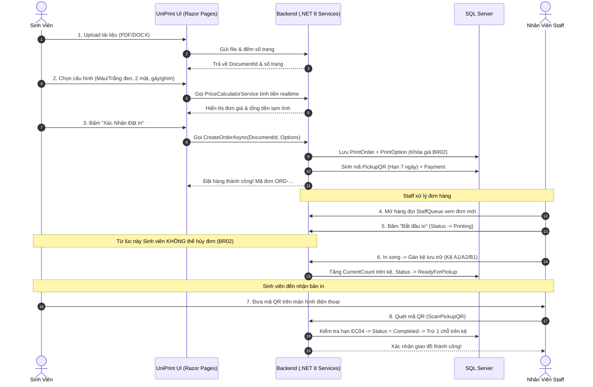
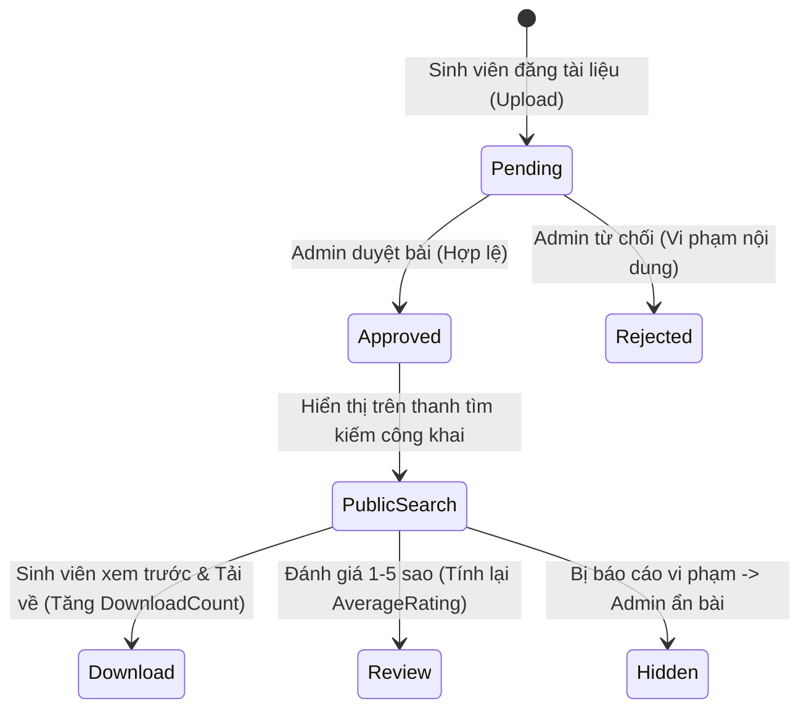
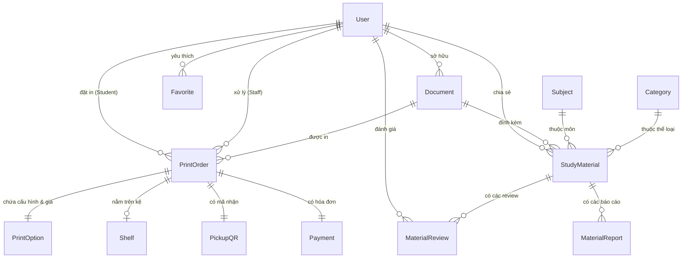

# UniPrint Platform - Tài Liệu Đặc Tả Tính Năng & Use Cases

Tài liệu này cung cấp cái nhìn toàn diện về mặt nghiệp vụ, luồng xử lý (Business Flows), danh sách Use Cases và các ràng buộc hệ thống cho bất kỳ lập trình viên nào khi clone dự án về có thể nắm bắt và phát triển tiếp ngay lập tức.

---

## 1. Tổng Quan Hệ Thống

**UniPrint** là nền tảng trực tuyến phục vụ 2 mục đích cốt lõi cho sinh viên và ban quản lý trường học:
1. **Printing Platform (Nền tảng in ấn trực tuyến - Core Flow):** Cho phép sinh viên tải tài liệu cá nhân lên, cấu hình in (đen trắng/màu, 1/2 mặt, bấm kim/đóng gáy), xem tính giá tức thời, chốt đơn in, thanh toán và lấy tài liệu tại quầy bằng cách quét mã QR trên kệ lưu trữ.
2. **Study Hub (Kho học liệu số dùng chung - Secondary / Plug-and-Play Module):** Cho phép sinh viên chia sẻ tài liệu ôn thi, bài giảng, xem trước, tải về, đánh giá sao, báo cáo vi phạm (cần Admin kiểm duyệt trước khi hiển thị công khai).

---

## 2. Ma Trận Vai Trò & Phân Quyền (Actor & Permission Matrix)

Hệ thống có **3 tác nhân (Actors)** với ranh giới quyền hạn rõ ràng:

| Tính Năng / Nghiệp Vụ | Sinh Viên (Student) | Nhân Viên In Ấn (Staff) | Quản Trị Viên (Admin) | Ghi chú nghiệp vụ |
| :--- | :---: | :---: | :---: | :--- |
| **Đăng ký tài khoản** | ✅ | ❌ | ❌ | Sinh viên tự đăng ký; Staff/Admin do Admin tạo |
| **Đăng nhập / Đổi mật khẩu / Profile** | ✅ | ✅ | ✅ | Xác thực bằng JWT Token & Cookie session |
| **Upload & Quản lý tài liệu cá nhân** | ✅ | ❌ | ❌ | Lưu metadata file trong DB |
| **Cấu hình in & Xem tính giá realtime** | ✅ | ❌ | ❌ | Tính tự động theo số trang & tùy chọn |
| **Tạo đơn in (Print Order)** | ✅ | ❌ | ❌ | Khóa cố định giá tại thời điểm tạo (BR02) |
| **Hủy đơn in** | ✅ (Có ĐK) | ❌ | ❌ | Chỉ hủy khi chưa in; đã in thì cấm hủy |
| **Xem hàng đợi in ấn (Staff Queue)** | ❌ | ✅ | ✅ | Xem các đơn `Pending` / `Processing` |
| **Cập nhật trạng thái in ấn** | ❌ | ✅ | ❌ | `Processing` $\rightarrow$ `Printing` |
| **Gán kệ lưu trữ (Shelf Assignment)** | ❌ | ✅ | ❌ | Kiểm tra sức chứa kệ trước khi gán (EC06) |
| **Quét mã QR giao tài liệu** | ❌ | ✅ | ❌ | Quét QR của sinh viên, đổi `Completed` |
| **Đăng tài liệu lên Study Hub** | ✅ | ❌ | ✅ | Phải qua trạng thái `Pending` chờ duyệt |
| **Kiểm duyệt tài liệu Study Hub** | ❌ | ❌ | ✅ | Admin bấm `Approved` hoặc `Rejected` (BR04) |
| **Tìm kiếm / Xem / Tải tài liệu Study Hub**| ✅ | ✅ | ✅ | Chỉ hiện tài liệu đã được `Approved` (EC08) |
| **Đánh giá sao (1-5 ⭐) & Báo cáo** | ✅ | ❌ | ✅ | Mỗi SV chỉ được đánh giá 1 lần/bài (BR05) |
| **Quản trị bảng giá in ấn** | ❌ | ❌ | ✅ | Thay đổi giá trang màu, đen trắng, bìa... |

---

## 3. Sơ Đồ Use Case Tổng Thể (Use Case Diagram)

```mermaid
graph TD
    subgraph Sinh Viên (Student)
        UC1[UC01: Đăng ký / Đăng nhập]
        UC2[UC02: Upload file & Cấu hình in]
        UC3[UC03: Xem tính giá realtime]
        UC4[UC04: Tạo đơn in PrintOrder]
        UC5[UC05: Xem mã Pickup QR nhận đồ]
        UC6[UC06: Hủy đơn hàng]
        UC7[UC07: Đăng tài liệu Study Hub]
        UC8[UC08: Tải tài liệu & Đánh giá sao]
    end

    subgraph Nhân Viên (Staff)
        UC9[UC09: Xem hàng đợi in ấn]
        UC10[UC10: Cập nhật tiến trình in]
        UC11[UC11: Gán kệ lưu trữ Shelf]
        UC12[UC12: Quét mã QR trả đồ cho SV]
        UC13[UC13: Xác nhận thanh toán tiền mặt]
    end

    subgraph Quản Trị Viên (Admin)
        UC14[UC14: Quản trị bảng giá in ấn]
        UC15[UC15: Kiểm duyệt bài viết Study Hub]
        UC16[UC16: Xem báo cáo vi phạm]
    end
```

---

## 4. Quy Trình Nghiệp Vụ Chi Tiết (Business Workflows)

### 4.1. Luồng In Ấn Cốt Lõi (Printing Platform Flow)



---

### 4.2. Luồng Kho Tài Liệu Study Hub (Tách Biệt Độc Lập)



---

## 5. Quy Tắc Nghiệp Vụ Cần Ghi Nhớ (Business Rules - BR)

* **BR01 – Phân quyền truy cập:** Sinh viên tự đăng ký. Staff và Admin do Admin cấp. Mọi endpoint đều được bảo vệ bởi RBAC chặt chẽ ở cả Backend (`[Authorize]`) lẫn Frontend (`RouteGuard` / `AuthorizeFolder`).
* **BR02 – Chốt giá & Hủy đơn in:**
  - Giá in được **khóa cố định vào thời điểm tạo đơn**. Dù sau này Admin có thay đổi bảng giá thì đơn cũ vẫn giữ nguyên giá đã chốt.
  - Sinh viên **chỉ được hủy đơn** khi trạng thái là `Pending` hoặc `Processing`. Khi Staff đã bấm bắt đầu in (`Printing`), hệ thống chặn tuyệt đối không cho hủy.
* **BR03 – Phương thức thanh toán:** Hỗ trợ thanh toán tiền mặt tại quầy (`Cash`) hoặc quét mã chuyển khoản VietQR (`VietQR_PayOS`). Có thể thanh toán trước hoặc thanh toán lúc nhận hàng.
* **BR04 – Kiểm duyệt tài liệu:** Mọi tài liệu sinh viên đăng lên Study Hub mặc định ở trạng thái `Pending`. Chỉ sau khi Admin duyệt (`Approved`) thì tài liệu mới được xuất hiện ngoài trang chủ và ô tìm kiếm.
* **BR05 – Đánh giá & Bình luận:** Mỗi sinh viên chỉ được gửi tối đa 1 đánh giá (1–5 sao kèm nhận xét) cho mỗi tài liệu. Có thể cập nhật lại điểm đánh giá của mình. Điểm hiển thị của tài liệu là trung bình cộng (`AverageRating`).

---

## 6. Các Tình Huống Xử Lý Ngoại Lệ (Edge Cases - EC)

* **EC01 – File tải lên bị lỗi:** File bị hỏng hoặc định dạng lạ $\rightarrow$ Hệ thống bắt lỗi, từ chối tạo `Document`.
* **EC04 – Mã QR hết hạn:** Mã QR quá hạn 7 ngày $\rightarrow$ Nhân viên quét sẽ nhận được thông báo lỗi từ chối, đơn hàng vẫn giữ trạng thái `ReadyForPickup` chờ cấp lại mã.
* **EC06 – Kệ lưu trữ đầy chỗ:** Mỗi kệ có sức chứa (`MaxCapacity = 20`). Khi `CurrentCount >= MaxCapacity`, hệ thống chặn không cho gán thêm đơn vào kệ đó, buộc Staff phải chọn kệ khác còn trống.
* **EC08 – Tài liệu chưa duyệt:** Tuyệt đối không xuất hiện trong API tìm kiếm công khai, chỉ người tải lên và Admin mới thấy được trạng thái bài đăng.

---

## 7. Cấu Trúc Bảng Dữ Liệu (Entity Relationship Diagram - ERD)



---

## 8. Hướng Dẫn Cắt Bớt Chức Năng Khi Chuyển Sang Môn Học Khác

Nếu nhóm đem đồ án này sang môn học khác (như làm **Ứng dụng Di động Flutter/Kotlin**, làm đồ án môn học thu nhỏ scope):
1. **Module cần cắt:** Cắt bỏ hoàn toàn **Study Hub**.
2. **Cách cắt:**
   - Ẩn menu `Study Hub` trên giao diện (`Pages/StudyHub/`).
   - Giữ nguyên toàn bộ 4 Module còn lại: Tài khoản, Đặt in, Hàng đợi Staff, Kệ lưu trữ & Quét mã QR.
   - Luồng in ấn chính vẫn là một hệ sinh thái **hoàn hảo 100% không hề bị lỗi**.
